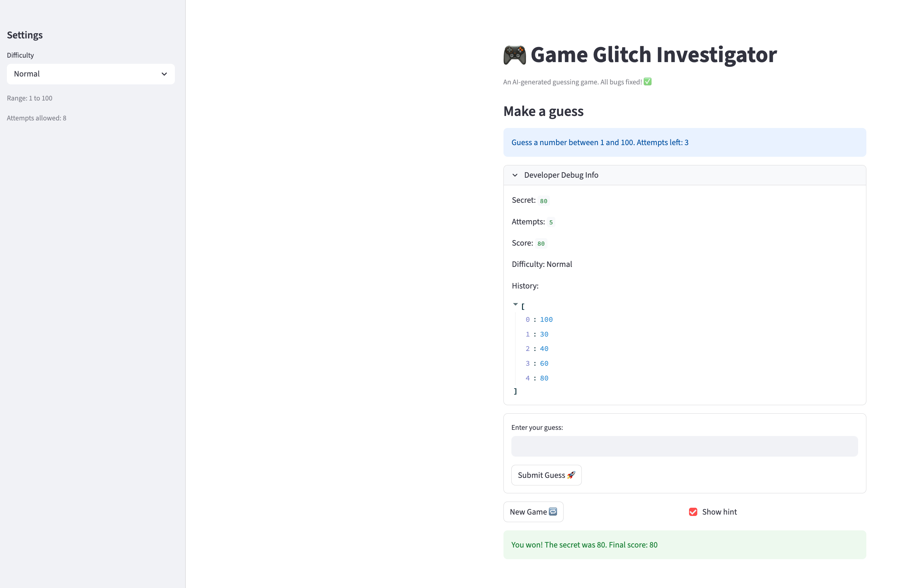

# 🎮 Game Glitch Investigator: The Impossible Guesser

## 🚨 The Situation

You asked an AI to build a simple "Number Guessing Game" using Streamlit.
It wrote the code, ran away, and now the game is unplayable. 

- You can't win.
- The hints lie to you.
- The secret number seems to have commitment issues.

## 🛠️ Setup

1. Install dependencies: `pip install -r requirements.txt`
2. Run the broken app: `python -m streamlit run app.py`

## 🕵️‍♂️ Your Mission

1. **Play the game.** Open the "Developer Debug Info" tab in the app to see the secret number. Try to win.
2. **Find the State Bug.** Why does the secret number change every time you click "Submit"? Ask ChatGPT: *"How do I keep a variable from resetting in Streamlit when I click a button?"*
3. **Fix the Logic.** The hints ("Higher/Lower") are wrong. Fix them.
4. **Refactor & Test.** - Move the logic into `logic_utils.py`.
   - Run `pytest` in your terminal.
   - Keep fixing until all tests pass!

## 📝 Document Your Experience

### 🎯 Game Purpose
This is a number guessing game built with Streamlit. The player selects a difficulty level (Easy: 1–20, Normal: 1–100, Hard: 1–1000), then tries to guess a secret number within a limited number of attempts. After each guess, the game gives a "Too High" or "Too Low" hint. The player earns a score starting at 50 points — each wrong guess deducts 5 points, and a correct guess awards a 50-point bonus (capped at 100). The goal is to guess correctly in as few attempts as possible.

### 🐛 Bugs Found
1. **Secret number kept changing** — `random.randint()` was called directly in the script body, so every Streamlit rerun (triggered by any button click) generated a new secret number.
2. **Backwards hints** — The "Too High" and "Too Low" messages were swapped, actively misleading the player.
3. **Exception handler crash** — `check_guess()` compared an integer guess to a string secret number using `>` / `<`, throwing a `TypeError` instead of returning a hint.
4. **No range validation** — Out-of-range inputs (e.g., `0` or `150` on Normal mode) were silently accepted and given directional hints instead of an error.
5. **Attempt counter not updating** — The attempts display in the debug panel did not reflect the current count because Streamlit's rerun wiped the intermediate state before it could render.
6. **New Game button broken** — Clicking "New Game" did not reset the game state or generate a new secret number.
7. **Broken scoring system** — The original scoring logic did not keep scores in the 0–100 range and gave no live feedback during the game.
8. **Hard difficulty unbalanced** — Hard mode originally allowed only 5 attempts for a 1–1000 range, making it statistically near-impossible to win.

### 🔧 Fixes Applied
1. **Stable secret number** — Wrapped `random.randint()` in a session state guard (`if "secret" not in st.session_state`) so it only runs once on the first load.
2. **Corrected hints** — Swapped the "Too High" / "Too Low" return values in `check_guess()` to match the correct logic.
3. **Safe comparison** — Added a `try/except` block in `check_guess()` with a string-based fallback comparison to prevent `TypeError` crashes.
4. **Range validation** — Added bounds checking in `parse_guess()` that returns `ok=False` with a clear error message for out-of-range inputs.
5. **UI sync with `st.rerun()`** — After a valid guess, the hint is stored in `st.session_state.current_hint` and `st.rerun()` is called so the updated attempt count and hint render correctly on the next frame.
6. **Form-based input** — Wrapped the guess input and submit button in `st.form(clear_on_submit=True)` to prevent Streamlit's double-rerun from swallowing valid submissions.
7. **New Game reset** — The "New Game" button now deletes all relevant session state keys, forcing a clean reinitialisation on the next rerun.
8. **Redesigned scoring** — Score starts at 50, loses 5 per wrong guess (floor 0), and gains 50 on a win (cap 100), keeping all scores in the 0–100 range with live feedback.
9. **Balanced difficulty** — Attempt limits updated to Easy: 6, Normal: 8, Hard: 11 (optimal binary search on 1–1000 requires ~10 guesses).

## 📸 Demo

## 🚀 Stretch Features

- [ ] [If you choose to complete Challenge 4, insert a screenshot of your Enhanced Game UI here]
